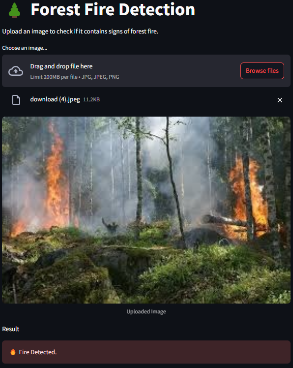
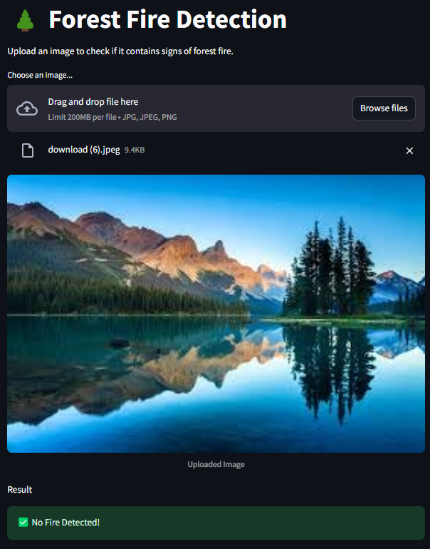

# 🌲 Forest Fire Detection Web App

This is a deep learning-powered web application that detects signs of wildfire in uploaded images. Built using **TensorFlow** and **Streamlit**, the app predicts whether an image contains fire or not using a pre-trained Keras model.

---

## 🔧 Tech Stack

- Python 🐍
- TensorFlow / Keras
- Streamlit
- PIL (Python Imaging Library)
- NumPy

---

## 🚀 How to Run the App

### 1. **Clone the Repository**

```bash
git clone https://github.com/AjinkyaLadkat/Forest_Fire_Detection_Using_DL.git
cd forest-fire-detection
```

### 2. **Install Dependencies**
```bash
pip install -r requirements.txt
```
or run 
```bash
pip install streamlit tensorflow pillow numpy
```

### 3. **Download the pre-trained model**
```bash
Drive link for Keras model - https://drive.google.com/drive/folders/1RPv3a1DYLTEwIJ08DuBr_z3yznls6oFC?usp=drive_link
```
or,(*Optional*) create the model and train it using the Jupyter notebook file and Google Colab(use v2 file)
```bash
Drive link for Jupyter Notebook File - https://drive.google.com/drive/folders/1GEEjrKLzNdZH2aW9zh3Ik8BeK1njUFt0?usp=drive_link
```
(*Optional*) **Save the trained model**
```bash
model.save("FFDv2.keras")
```

### 4. **Run the app**
```bash
streamlit run app.py
```

### 5. **View the running app**
Follow this link from terminal
```bash
http://localhost:8501
```

## 🔧 How It Works?

- Upload an image via the UI.
- The app resizes and normalizes the image
- It passes the image through a trained binary classification model.
- If the model predicts a value > 0.5 → ✅ No Fire Detected
- If the prediction ≤ 0.5 → 🔥 Fire Detected

## 📸 Sample Output



 ---

### ✅ No Fire Detected


##  Acknowledgements
- Inspired by wildfire prevention and satellite-based detection systems.
- Built for educational and demonstration purposes.

## 📞 Contact
📧 Email: [ladkatajinkya18@gmail.com]  
🔗 LinkedIn: [Ajinkya Ladkat](www.linkedin.com/in/ajinkya-ladkat-b14a39273)


## 📝 License
This project is licensed under the MIT License - see the [LICENSE](LICENSE.txt) file for details.
